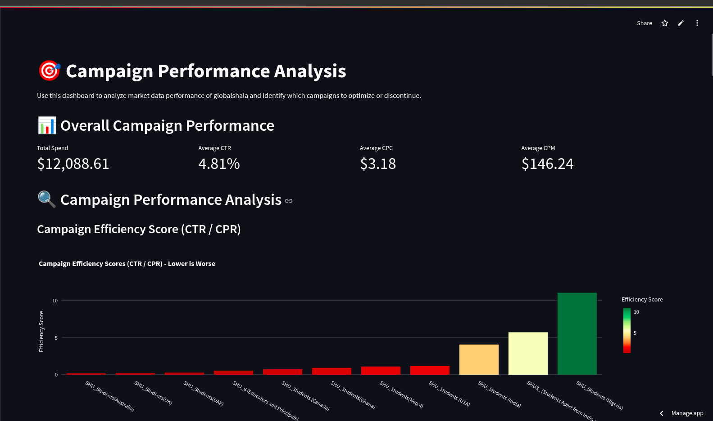

<!-- @format -->

# 📊 **Campaign Performance Analyzer**

A **Streamlit dashboard** for analyzing digital marketing campaigns. It calculates key performance metrics, visualizes trends, and recommends underperforming campaigns for discontinuation based on composite scoring.

---

### 🚀 **Features**

✅ Interactive filters (by campaign, audience, age, geography)
✅ Key metrics: CTR, CPC, CPM, CPR, ROI
✅ Campaign-level efficiency and ROI analysis
✅ Bubble chart quadrant for spend vs performance
✅ Automated discontinuation recommendation with explanation
✅ Comparative analysis between campaigns
✅ Downloadable reports

---

### 📂 **Project Structure**

```
├── campaign_dashboard.py                  # Main Streamlit application
├── data.csv                # Campaign data CSV file
├── README.md               # This file
├── requirements.txt        # Python dependencies
```

---

### 🛠️ **Installation**

1️⃣ **Clone the repository:**

```bash
git clone https://github.com/fearalert/Data_Internship_excelerate.git
cd Data_Internship_excelerate/Task_1
```

2️⃣ **(Optional) Create virtual environment:**

```bash
python -m venv venv
source venv/bin/activate  # Windows: venv\Scripts\activate
```

3️⃣ **Install dependencies:**

```bash
pip install -r requirements.txt
```

---

### 📈 **Running the App**

```bash
streamlit run campaign_dashboard.py
```

✅ App will open in your browser at `http://localhost:8501`

---

## 📄 **Sample Data Format**

| campaign ID | Campaign Name                    | Audience                 | Age   | Geography                                                     | Reach | Impressions | Frequency | Clicks | Unique Clicks | Unique Link Clicks (ULC) | Click-Through Rate (CTR in %) | Unique CTR (%) | Amount Spent in INR | CPC    | CPR    |
| ----------- | -------------------------------- | ------------------------ | ----- | ------------------------------------------------------------- | ----- | ----------- | --------- | ------ | ------------- | ------------------------ | ----------------------------- | -------------- | ------------------- | ------ | ------ |
| Campaign 1  | SHU_6 (Educators and Principals) | Educators and Principals | 25-34 | Group 1 (Australia, Canada, UK, Ghana, Nigeria, Pakistan, US) | 11387 | 23283       | 2.04      | 487    | 406           | 180                      | 2.09                          | 3.57           | \$1,092.24          | \$2.24 | \$6.07 |

✅ Columns are customizable in `campaign_dashboard.py` → `load_data()` function.

---

## 📊 **Recommendation Report**

**📝 Campaign Discontinuation Recommendation**

> **Recommended Campaign to Discontinue:** > **SHU_Students (Australia)**

### 📌 **Performance Metrics for this Campaign:**

| Metric             | Value    |
| ------------------ | -------- |
| Efficiency Score   | 0.1921   |
| ROI Score          | 0.0458   |
| CTR                | 4.35%    |
| CPR                | \$23.11  |
| CPC                | \$7.92   |
| Total Spend        | \$850.68 |
| Impressions        | 3,572    |
| Clicks             | 119      |
| Unique Link Clicks | 44       |

### 💡 **Recommendation Reasoning:**

This campaign has been identified as the **worst performer** based on a **composite score** calculated from:

- ✅ **Efficiency Score (CTR/CPR):** How well the campaign converts views to clicks relative to cost
- ✅ **ROI Score (ULC/Spend):** Return on investment in terms of valuable user actions
- ✅ **Cost per Result (CPR):** Cost efficiency of achieving a desired outcome

🔍 The low composite score indicates poor performance across these metrics. Budget is recommended to be **reallocated to better-performing campaigns**.

---

### 📌 **Customization**

Modify the composite score formula in `campaign_dashboard.py` to adjust weightings:

```python
campaign_efficiency['Composite Score'] = (
    (campaign_efficiency['Efficiency Score'] / campaign_efficiency['Efficiency Score'].max()) * 0.4 +
    (campaign_efficiency['ROI Score'] / campaign_efficiency['ROI Score'].max()) * 0.4 +
    (1 - (campaign_efficiency['Cost per Result (CPR)'] / campaign_efficiency['Cost per Result (CPR)'].max())) * 0.2
)
```

---

## 🖼️ **Dashboard Preview**

## 

## 🤝 **Contributing**

Pull requests welcome! For major changes, open an issue first to discuss.

---

## 📬 **Contact**

🐙 GitHub: [github.com/fearalert](https://github.com/fearalert)

---

✅ Ready for deployment on **Streamlit Cloud**, **Heroku**, or **AWS**.
